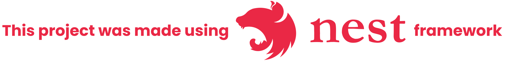

<!-- color: #e0234e; -->
<div align="center">
  <a href="http://nestjs.com/" target="blank">
    
  </a>
</div>

<br>

<div align="center">
  
</div>

<br>

## **Description**

The project consists of an online platform for buying and selling books and stationery. Written with Typescript the backend provides the necessary data for the <a href="https://github.com/paperbook-official/web.react.paperbook">application frontend</a>.

<hr />

## **Getting started**

First you must to clone the repository using:

```bash
$ git clone 'https://github.com/paperbook-official/api.nestjs.paperbook.git'
```

After that install all the needed dependencies with:

```bash
$ npm install -g @nestjs/cli

$ npm install
```

This project uses <strong>husky's commit-msg hook</strong> and <a href="https://commitlint.js.org/">commitlint</a>. For using them run the following commands:

```bash
$ npx husky install

$ npx husky add .husky/commit-msg 'npx --no-install commitlint --edit $1'
```

<hr />

## **Running the app**

```bash
# development
$ nest start

# watch mode
$ nest start --watch

# production mode
$ nest start --prod
```

### **Docker**

The application uses Docker and it can be runned using the follwing:

```bash
$ sudo docker-compose -up
```

<hr />

## **Databases**

### **SQLite**

To test this application, SQlite database can be used, it is added in dependencies by default. To use simply run any of the application startup commands shown above.

> **obs: You must not forget of setting up the .env file**

### **Postgres**

The PostgreSQL is used for production environments.

<hr />

## **Migrations**

For creating a new migration run the command:

```bash
$ npm run typeorm:migrate MIGRATION_NAME
```

And for executing all the migrations run:

```bash
$ npm run typeorm:run
```

<hr />

## **Structure**

Always, when creating a new entity, create a folder in 'src/modules' with the entity name (Ex: 'src/modules/product' ).
Inside the folder, it must have the following structure:

- `product`
  - `controllers` (All the controllers related with products)
    - `product.controller.ts`
  - `services` (All the services related with products)
    - `service.controller.ts`
  - `entities` (All the entities related with products)
    - `product.entity.ts`
  - `models` (All the models related with products)
    - `create-product.dto.ts`
    - `product.dto.ts`
    - `update-product.dto.ts`
  - `product.module.ts`

<hr>

## **Authentication**

This project has only one authentication method, the **local**.
Basically login to the application can be done using the user's email and password.

<hr>

## **Swagger**

The backend is integrated with <a href="https://swagger.io/">Swagger API</a>, allowing the developer to view and test the API routes.

To use this put in browser url the following:

```
API_ENDPOINT/swagger
```

<hr>

## **Sentry**

The application is also integrated with <a href="https://sentry.io/">Sentry</a> this way it allows tracking exceptions and storing them.

<!-- ## **Test**

```bash
# unit tests
$ npm run test

# e2e tests
$ npm run test:e2e

# test coverage
$ npm run test:cov
``` -->

<!-- ## **Support**

Nest is an MIT-licensed open source project. It can grow thanks to the sponsors and support by the amazing backers. If you'd like to join them, please [read more here](https://docs.nestjs.com/support).

## **Stay in touch**

- Author - [Kamil Myśliwiec](https://kamilmysliwiec.com)
- Website - [https://nestjs.com](https://nestjs.com/)
- Twitter - [@nestframework](https://twitter.com/nestframework) -->

<hr>

## **License**

Paperbook API is [MIT licensed](LICENSE).
